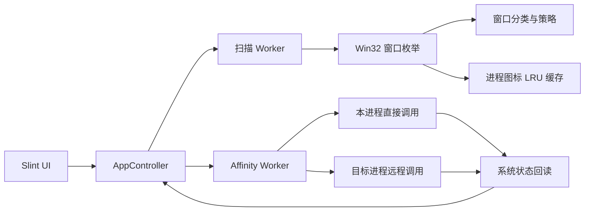

<div align="center">

# Window Sharing Hider

**将指定 Windows 窗口排除在受支持的会议共享与屏幕捕获画面之外。**

原生 Rust 桌面应用。没有 WebView，没有常驻服务，不依赖 .NET 运行时。

<p>
  
  
  
  <a href="LICENSE"></a>
</p>

<p>
  <a href="https://github.com/MiChongs/WindowSharingHider/commits/main"></a>
  <a href="https://github.com/MiChongs/WindowSharingHider"></a>
</p>

</div>

> [!IMPORTANT]
> 本项目依赖 Windows 的 [`SetWindowDisplayAffinity`](https://learn.microsoft.com/windows/win32/api/winuser/nf-winuser-setwindowdisplayaffinity)。它只影响尊重该机制的捕获 API，不是 DRM、驱动级防录屏或安全边界。

## 功能

- 枚举可保护的桌面窗口，显示标题、所属进程、窗口类名和原生应用图标。
- 使用 `WDA_EXCLUDEFROMCAPTURE` 切换窗口捕获排除状态，并实时回读系统实际状态。
- 支持 x64 主程序处理 x64 与 WOW64 目标进程。
- 可选显示系统窗口与输入法窗口；内置微信输入法候选框识别策略。
- 扫描与 affinity 操作分别运行在后台线程，界面线程不执行 Win32 调用。
- 失败、超时、窗口退出和权限不足均按窗口隔离，不会阻塞整次刷新。
- 原生 Fluent 风格 Slint 界面，支持高 DPI、键盘操作、长标题截断及深浅色构建主题。
- 进程图标采用有界正负缓存；刷新时不会反复读取或解码同一可执行文件。

## 系统要求

| 项目 | 要求 |
| --- | --- |
| 操作系统 | Windows 10 Version 2004 或更新版本；推荐 Windows 11 |
| 架构 | 推荐 `x86_64-pc-windows-msvc` |
| Rust | 1.97 或更新版本 |
| 构建工具 | MSVC Build Tools 与 Windows SDK |
| 权限 | 普通窗口通常无需管理员权限；高完整性或受保护进程可能需要提升权限，且仍可能拒绝访问 |

`WDA_EXCLUDEFROMCAPTURE` 从 Windows 10 Version 2004 开始可用。旧系统只能提供有限或不同的显示 affinity 行为。

## 快速开始

### 从源码运行

```powershell
rustup default stable-x86_64-pc-windows-msvc
cargo run --release
```

### 构建发布版本

```powershell
cargo build --release
```

生成文件位于：

```text
target\release\window-sharing-hider.exe
```

项目是单一桌面可执行程序；运行时无需 .NET、Node.js 或浏览器内核。

### 构建深色主题

默认使用 Slint Fluent 主题。需要固定深色构建时：

```powershell
$env:SLINT_STYLE = "fluent-dark"
cargo build --release
Remove-Item Env:SLINT_STYLE
```

## 使用方法

1. 启动应用，等待窗口列表首次刷新。
2. 找到需要排除的窗口，打开该行右侧开关。
3. 状态显示为“已保护”后，在会议软件或捕获工具中重新选择共享源并确认效果。
4. 窗口被关闭、重建或句柄发生变化时，点击“刷新列表”。
5. 需要处理桌面宿主、输入法或其他系统候选窗口时，再启用“显示系统与输入法窗口”。

微信输入法候选框策略会持续发现匹配窗口，并在窗口重建后重新应用策略。普通窗口则始终以当前扫描结果和系统回读状态为准。

## 工作原理

Windows 要求调用 `SetWindowDisplayAffinity` 的进程拥有目标窗口。对其他进程的窗口，本项目会解析目标进程中的系统函数地址，在目标进程内执行最小调用，再回读实际 affinity 值确认结果。



远程调用链包含严格的资源所有权、超时与清理逻辑：进程句柄、远程内存和线程句柄均由 RAII 类型管理；失败只影响当前目标窗口。

## 项目结构

```text
WindowSharingHider/
├── Cargo.toml                 # Rust 包、Windows 与 Slint 依赖
├── Cargo.lock                 # 可复现的应用依赖版本
├── build.rs                   # Slint UI 编译配置
├── ui/
│   └── app.slint              # Fluent 桌面界面与窗口行组件
└── src/
    ├── main.rs                # Windows GUI 入口与 Slint 绑定
    ├── app.rs                 # 应用状态、合并刷新结果与界面视图模型
    ├── model.rs               # WindowKey、Affinity、图标与操作状态
    ├── policy.rs              # 窗口分类、显示与自动重试策略
    ├── worker.rs              # 扫描和 affinity 后台工作线程
    └── platform/
        ├── mod.rs             # 平台抽象
        └── windows/
            ├── affinity.rs    # affinity 应用与系统状态回读
            ├── enumeration.rs # Unicode Win32 窗口枚举
            ├── icons.rs       # Windows Shell 图标提取与有界缓存
            ├── remote.rs      # PE 导出解析及 x86/x64 远程调用 stub
            └── resources.rs   # HANDLE、远程内存和线程 RAII
```

## 捕获兼容性

效果取决于捕获程序是否尊重 Windows display affinity。Windows Graphics Capture 及部分会议软件通常支持；旧式抓屏、驱动级采集、摄像机拍摄或绕过系统合成器的方案可能忽略该标志。

建议在实际使用的会议软件、Windows 版本和显卡驱动组合上验证。不同版本的 Teams、Zoom、Discord、OBS 或浏览器可能采用不同捕获后端，不能仅凭应用名称保证结果。

## 安全软件提示

为了处理不属于当前进程的窗口，本项目需要使用以下 Windows API：

- `OpenProcess`
- `VirtualAllocEx`
- `WriteProcessMemory`
- `CreateRemoteThread`
- `ReadProcessMemory`

这些 API 也常见于调试器、辅助工具和恶意软件，因此部分安全产品可能产生启发式告警。源码完整公开；建议自行审阅并从源码构建。请勿将本程序用于未经授权的进程操作。

## 开发与验证

```powershell
cargo fmt --all --check
cargo test
cargo build --release
```

测试覆盖领域模型、窗口分类策略、扫描结果合并、工作线程协议、PE 导出解析、远程资源清理和进程图标缓存。涉及真实窗口与捕获软件的行为仍应进行 Windows 桌面烟测。

## 许可证

项目采用 [MIT License](LICENSE)。
